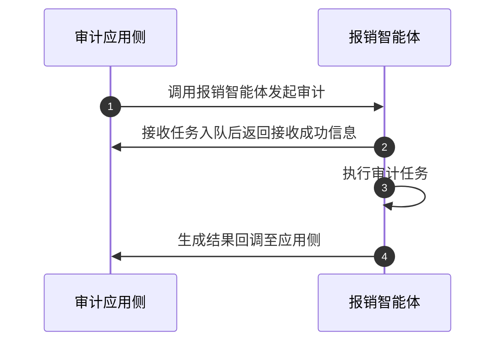
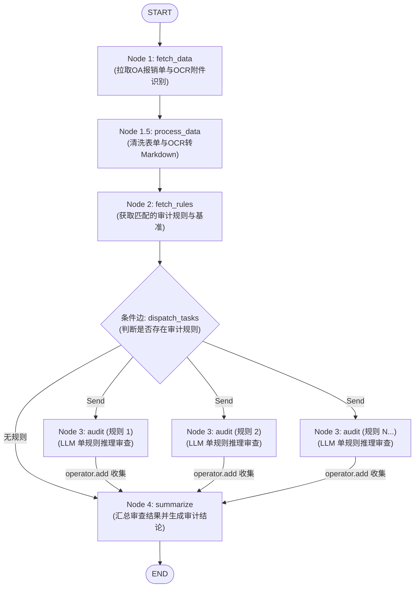

> 此前针对单条规则审计的优化做了个笔记。本篇主要复盘一下整体的设计思路

## 业务背景
审计工作依赖人工对照清单逐项核查，工作量大、进度难跟踪，风险发现滞后，复核沟通成本高。需提升审计效率与风险发现及时性，缩短审计周期。
由于现场涉及其他系统的情况，本阶段重点主要在于事后审计，便于减轻审计部的需要阅读比对大量报销材料的负担。

## 架构设计
该报销单审计智能体项目在设计时考虑到需要严格按照步骤流程并且完整对来自应用侧多变多样的规则进行审计，选择了workflow的设计，并未采用llm+skill这种以llm自主决策的模式，确保结果可溯源可审计。该阶段的重点在于事后审计，但是设计上也需要考虑到了后续如何便捷用于事前审计，要支持材料更新后或者整体任务失败后，应用侧可发起重跑重新审计。

整体采用FastAPI+ARQ+Langgraph。由于任务中涉及ocr识别、llm输出等耗时较长的工作，且审计任务不像传统问答需要即时反馈，系统采用了异步受理模式：设计为应用侧发起调用，审计任务进入到队列后即返回接收成功状态，利用ARQ和to_thread机制进行任务调度，将任务放置其他线程中，以确保主线程不被长期占用。保持智能体内部处于无状态，应用侧每次调用智能体接口都是新的一次审计任务发起。设计了两张表一张为任务表便于快速查找当前审计运行任务状态，另一张为任务明细表，当任务执行完成后会将state数据落库。

### 和应用侧的交互时序

### 智能体工作流流程
整体工作流设计如下，利用langgraph send()的动态分发和并发执行机制，根据审计任务绑定的规则数量不同并行执行不同的单条审计任务。确定好流程后对于state的设计就很清晰，全局状态存储每个节点的输入物和产物，用于审计使用的子状态只需要包含清洗好的单条规则、报销单信息和附件信息。



### 数据处理
数据处理我认为是本项目中的要点之一。在本项目中涉及调用多处接口获取信息，如报销流程接口、规则接口，以及附件的获取，返回的接口信息都是含义模糊的英文字段名并且涉及多样的层级和格式，直接把原始json扔进llm里会带来噪声干扰，对于这些接口信息和附件的数据处理尤为重要。主要涉及以下几方面的数据处理：
  1. 数据字段的中文映射：对接口信息进行字段的中文映射，以明确各字段的实际含义，并且对无意义的字段（如id等）进行过滤，降低干扰。
  2. 字典数据处理：规则接口中涉及大量规则标准，这些规则标准是以字典的形式进行存放的，为了减少符号在后续审计时带来的噪声，将其转化为markdown表格格式。
  3. ocr结果处理：在本项目中采用的是rapid ocr，识别返回的结果有无序的text和boxes。由于报销附件涉及各种发票、表单，文字排版各式各样，盲目直接把rapid ocr的输出结果拼接起来，会造成难以阅读或者信息错乱。故采用了两种方式进行处理：①优先使用llm的推理能力，将文字和对应的坐标提供给llm，使其根据报销的场景将所有关键事实信息（如行程、金额、日期、人员等）输出为使llm更易理解的md表格。②设置了兜底的模式，根据每个单字的 ```box_final: [xmin, ymin, xmax, ymax]``` 空间坐标，将单字按行聚合为连续文本。

### 重试和兜底机制
在该项目中，重点对以下节点做了失败重试和兜底机制。
【前提：每次审计运行任务都有来自应用侧唯一的run_id, 每个审计任务（audit_id）有对应多个run_id】
1. 收到应用侧调用信息，智能体侧会先检查当前run_id是否已有，避免重复入队，保持幂等性。
2. 若出现入队失败（多次重试后），则将任务状态更新为失败，并且将失败信息返回应用侧。
3. 图的全局均有做失败兜底，raise报错，将报错落库并且上报到回调接口。接口调用若为网络问题均做指数等待重试。
4. 大模型执行失败会根据不同失败原因进行处理：
    - 格式化输出校验错误：带入错误信息进入上下文进行重试 
    - token超限（针对单个规则审查）：重试时调整温度和惩罚参数
    - 网络波动问题：等待重试，若多次重试没成功raise错误或者降级（ocr使用兜底模式）
    - 模型不存在/key不存在 ：直接切断
    - 其他问题：直接切断


## 一些选型理由补充
### 1. 为什么不选择skill？
审计流程是固定的必走的流程方向，已经确定的东西没有必要依赖llm去使用skill，反而会把确定变成不确定。另外结果和中间过程要能可溯源可审计，使用skill相当于把过程放在了llm的黑盒之中。

---

### 2. 为什么不使用checkpoint？
一般使用checkpoint的场景主要是有需要用户补充提交信息，常见于边聊边办等业务场景。但是在本场景中，无论是事前审计还是事后审计，用户提交补充材料都不是通过智能体的对话框，而是重新提交oa（如果要做成对话里提交的话那还需要oa再提供一些上传材料更新信息的接口，反而平白增加工程上的复杂度）。重新提交oa意味着智能体下次审计时还是要重新获取一次oa。从上文提到的整体设计链路来看，获取oa数据在整体链路的起点侧，且oa数据为审计的基础数据源，一个材料的修改可能所有的规则都需要重新审计，故设计checkpoint意义不大，不如直接当作新的审计任务进行重跑，也便于和应用侧的交互。

---

### 3.为什么采用ARQ不采用celery？
放弃传统的celery改成选择轻量级的ARQ的原因是，智能体需要频繁进行API网络请求等（像其他智能体还有各类tool calls、查数据库等I/O操作），其核心瓶颈是高并发下的高I/O长等待，而不是CPU计算。Celery 默认的多进程（Prefork）模型在应对这种长耗时 I/O 任务时，每个并发都会独占一个完整的 Python 进程，在 AI 重依赖环境下极易导致服务器内存暴涨甚至 OOM（内存溢出）。而ARQ原生契合FastAPI的异步生态，仅需要单进程配合事件循环，就能很好地管理大量并发的大模型请求与超时重试。

---

### 4. 为什么使用to_threads来实现异步而不是async？

虽然应用层服务是异步的，但底层的审查链路强依赖本地的 RapidOCR 引擎（纯 CPU 密集型计算）以及 LangGraph 的同步节点流转。如果强行将这些同步阻塞组件直接置于 async 协程中执行，会导致 Python 单线程主事件循环被瞬间卡死，使 ARQ 无法并发监听新任务，且基于异步时钟的超时取消机制（job_timeout）也会彻底失效。

因此，我们采用 to_thread 将长耗时的 LangGraph 图执行与 OCR 计算全部卸载到独立的后台工作线程池中，彻底解放了 Worker 的主事件循环；同时配合 trace_scope 实现了多线程并发下的 run_id 全链路日志隔离。此外，针对长耗时任务容易占满数据库连接的问题，由于在图执行中无需获取数据库信息且因为不需要使用checkpoint持久化，我们设计了分段短会话机制，在图执行期间零占用数据库连接，只在图执行前后更新任务状态，从而兼顾了系统的高并发与资源稳定性。


